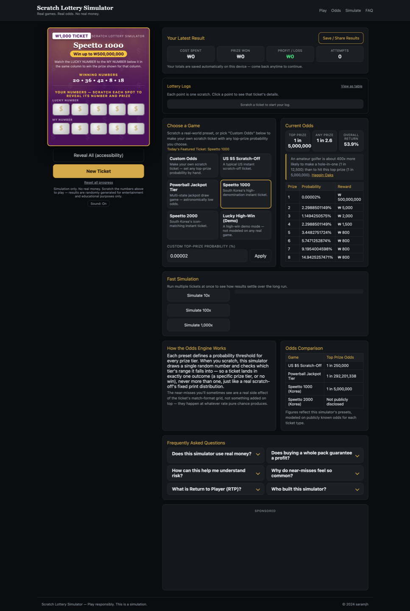
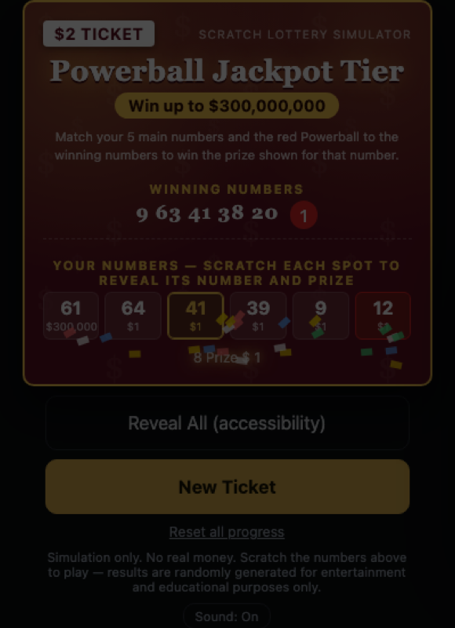
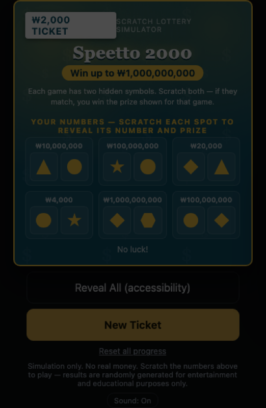
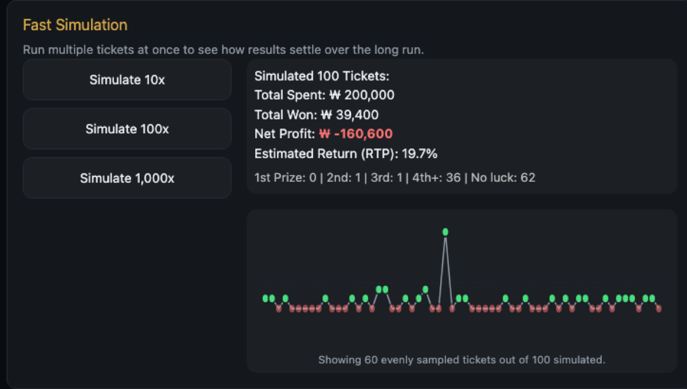
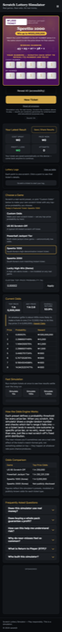

# Scratch Lottery Simulator

무료 스크래치 복권 체험 시뮬레이터. 실제 로또/복권(파워볼, 미국 $5 스크래치, 한국 스피또 1000/2000)의 공개된 확률을 기반으로 긁는 손맛만 재현하고, 실제 돈은 전혀 오가지 않습니다.

바로 해보기 → <https://saramjh.github.io/scratchLottery/>



## 이게 뭔가요

- 게임마다 실제 형식을 최대한 흉내낸 티켓: 파워볼은 흰 공 5개 + 빨간 보너스 볼 1개(고정 순서), 스피또 1000은 LUCKY NUMBER/MY NUMBER 두 줄 매칭, 스피또 2000은 게임칸마다 심볼 2개를 긁어서 맞추는 형식.
- 자리마다 독립된 `<canvas>`로 은박을 긁는 방식이라, 여러 칸을 한 번에 드래그해서 연속으로 긁을 수 있습니다.
- 확률 엔진은 CDF(누적분포) 기반 단일 추첨이라 한 장이 여러 등수에 동시 당첨되거나 잭팟이 다른 당첨으로 덮어써지는 일이 없습니다. "Custom Odds"를 고르면 원하는 1등 확률로 직접 나만의 티켓을 만들 수도 있습니다.
- 스크래치할 때마다 결과가 로터리 로그(시계열 차트)에 쌓이고, 노드를 클릭하면 그 티켓의 상세 정보를 볼 수 있습니다. 빠른 시뮬레이션(10x/100x/1,000x)으로 대수의 법칙이 실제로 확률표에 수렴하는 과정도 확인할 수 있습니다.
- 비용/당첨금/손익/횟수는 기기에 자동 저장되어 다시 방문해도 이어집니다.

## 스크린샷

| 파워볼 (5+1 보너스 볼) | 스피또 2000 (심볼 매칭) |
| --- | --- |
|  |  |

| 빠른 시뮬레이션 차트 | 모바일 화면 |
| --- | --- |
|  |  |

## 확률/RTP는 어떻게 계산되나요

각 프리셋은 1등 확률(`p1`)과 등수별 상금표(`rewards`)만 정의합니다. 등수별 한계확률(marginal probability)의 비율은 모든 프리셋이 공유하는 고정된 피보나치 비율 형태이고, 스크래치할 때마다 `drawLotteryResult`가 0~1 사이 난수를 한 번 뽑아 그 값이 어느 등수의 누적확률 구간에 속하는지로 결과를 정합니다 — 실제 인쇄복권의 고정된 확률 분포와 같은 방식입니다. 낮은 등수 상금은 이 확률 모델에서 계산되는 실제 RTP가 진짜 복권 수준(대략 50~70%)이 되도록 보정되어 있습니다.

## 기술 스택

빌드 도구나 프레임워크 없이 순수 HTML/CSS/JS로만 만들어졌고, GitHub Pages로 그대로 배포됩니다.

- `index.html` — 페이지 구조 (SEO 메타, 티켓 UI, 확률/시뮬레이션 패널, FAQ)
- `css/style.css` — 스타일 전체
- `js/script.js` — 확률 엔진, 티켓 생성/렌더링, 스크래치 인터랙션, 차트, localStorage 영속화, GA4 이벤트 트래킹

## 로컬에서 열어보기

빌드 과정이 없어서 그냥 정적 파일 서버로 열면 됩니다.

```bash
git clone <저장소 URL>
cd scratchLottery
python3 -m http.server 8000
# http://localhost:8000 접속
```

`index.html`을 파일로 직접 더블클릭해서 열어도 대부분 동작하지만, 상대 경로 fetch 등에서 브라우저 제약이 있을 수 있어 로컬 서버 사용을 권장합니다.

## 참고

스크래치(캔버스 지우기) 구현의 초기 아이디어는 [이 글](https://velog.io/@aromahyang/%EB%8F%99%EC%A0%84-%EA%B8%81%EA%B8%B0-%EC%95%A0%EB%8B%88%EB%A9%94%EC%9D%B4%EC%85%98/)을 참고했습니다.

## 주의 사항

이 사이트는 순수 시뮬레이션입니다. 실제 돈을 걸지 않고, 실제 복권을 구매하거나 판매하지 않습니다. 확률/RTP 수치는 각 프리셋이 참고한 공개 정보를 기반으로 하며, 특정 로또 사업자의 공식 수치와 100% 일치함을 보장하지 않습니다.

## 라이센스

이 프로젝트는 [MIT 라이센스](LICENSE)를 따릅니다.
