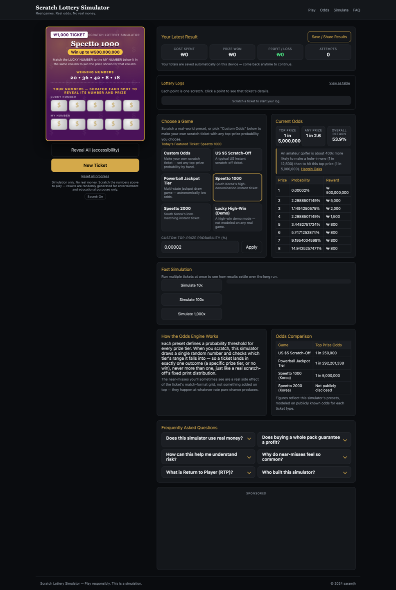
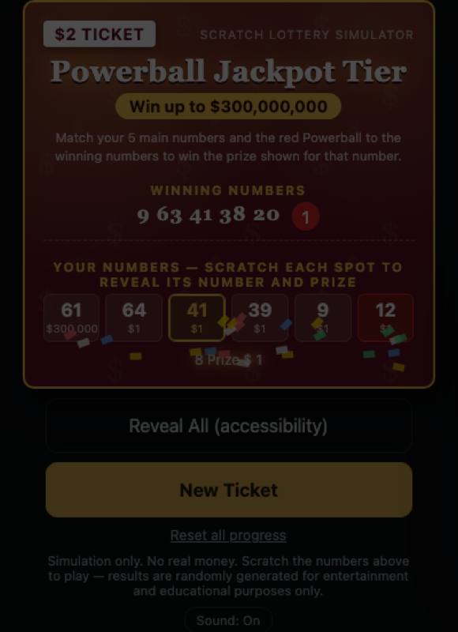
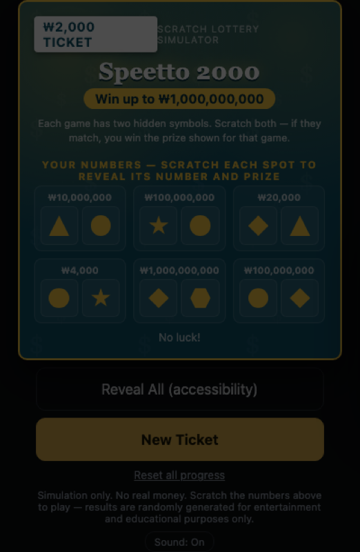

# Scratch Lottery Simulator

**[English](#english)** | **[한국어](#한국어)**

A free scratch-off lottery simulator. It reproduces the tactile "scratching" experience using the published odds of real lotteries (Powerball, US $5 scratch-offs, Korea's Speetto 1000/2000) — no real money is ever involved.

Try it → <https://saramjh.github.io/scratchLottery/>



---

## English

### What is this

- Tickets modeled after real formats as closely as possible: Powerball draws 5 white balls + 1 red bonus ball (in a fixed order), Speetto 1000 matches two rows (LUCKY NUMBER / MY NUMBER), and Speetto 2000 has you scratch two symbols per panel to find a match.
- Each cell scratches independently via its own `<canvas>`, so you can drag across multiple cells and scratch them in one continuous motion.
- The odds engine draws a single result per ticket from a CDF (cumulative distribution), so a single ticket can never win multiple prize tiers at once, and a jackpot can never get silently overwritten by a lower prize. Choosing "Custom Odds" lets you build your own ticket with any jackpot probability you want.
- Every scratch is logged to a time-series chart; clicking a node shows that ticket's full detail. Fast-forward simulations (10x/100x/1,000x) let you watch the law of large numbers converge on the theoretical odds table in real time.
- Experiment Lab turns a completed result into a follow-up question using the same exact-odds, simulation, budget-risk and long-run tools. My Lab can save experiment setups locally on this device for later reruns.
- The Math of Scratch-Off Lotteries page explains expected value, variance/law of large numbers and independent trials with interactive visuals driven by the same verified Texas Game 2755 issue model as the simulator.
- Official Prize Tracker keeps a bounded three-game Texas $5 watchlist from Texas Lottery published printed-prize/claimed-prize tables. Changed snapshots are archived automatically; the tracker does not infer unsold-ticket odds or current EV.
- Cost / winnings / profit / attempt count are saved to your device automatically, so your record picks up where you left off next time you visit.

### Screenshots

| Powerball (5+1 bonus ball) | Speetto 2000 (symbol matching) |
| --- | --- |
|  |  |

| Fast-simulation chart | Mobile view |
| --- | --- |
|  |  |

### How odds/RTP are calculated

Presets with a verified full issue table use the operator's published ticket count and winning-ticket count for each prize tier. The simulator converts those counts into cumulative probability ranges, and drawLotteryResult samples exactly one outcome from that distribution. RTP is calculated from each tier's marginal probability × prize amount divided by ticket cost. Presets without a verified full distribution, including Custom Odds, are explicitly treated as simulator models rather than official lower-tier distributions.

### Tech stack

No build tools or frameworks — plain HTML/CSS/JS, deployed as-is via GitHub Pages.

- `index.html` — page structure (SEO meta, ticket UI, odds/simulation panels, FAQ)
- `css/style.css` — all styling
- `js/script.js` — odds engine, ticket generation/rendering, scratch interaction, charts, localStorage persistence, GA4 event tracking
- `math/index.html` + `js/math-of-lottery.js` — interactive probability-learning page and state-driven teaching visuals
- `js/verified-lottery-models.js` + `js/lottery-math-core.js` — shared verified issue data and probability primitives consumed by both the simulator and math page
- `scripts/update_live_content.py` + `data/live/texas-scratch-watch.json` — stdlib-only official Texas claimed-prize snapshot updater/archive, run by the scheduled GitHub Action

### Running locally

There's no build step — just serve the files statically.

```bash
git clone <repo-url>
cd scratchLottery
python3 -m http.server 8000
# open http://localhost:8000
```

Double-clicking `index.html` to open it directly as a file mostly works too, but some browsers restrict relative-path fetches under the `file://` protocol, so a local server is recommended.

### Credits

The initial idea for the scratch (canvas-erasing) implementation came from [this article](https://velog.io/@aromahyang/%EB%8F%99%EC%A0%84-%EA%B8%80%EA%B8%B0-%EC%95%A0%EB%8B%88%EB%A9%94%EC%9D%B4%EC%85%98/).

### Disclaimer

This site is a pure simulation. No real money is wagered, and no real lottery tickets are bought or sold. Odds/RTP figures are based on the public information each preset references, and are not guaranteed to exactly match any specific lottery operator's official figures.

### License

This project is licensed under the [MIT License](LICENSE).

---

## 한국어

### 이게 뭔가요

- 게임마다 실제 형식을 최대한 흉내낸 티켓: 파워볼은 흰 공 5개 + 빨간 보너스 볼 1개(고정 순서), 스피또 1000은 LUCKY NUMBER/MY NUMBER 두 줄 매칭, 스피또 2000은 게임칸마다 심볼 2개를 긁어서 맞추는 형식.
- 자리마다 독립된 `<canvas>`로 은박을 긁는 방식이라, 여러 칸을 한 번에 드래그해서 연속으로 긁을 수 있습니다.
- 확률 엔진은 CDF(누적분포) 기반 단일 추첨이라 한 장이 여러 등수에 동시 당첨되거나 잭팟이 다른 당첨으로 덮어써지는 일이 없습니다. "Custom Odds"를 고르면 원하는 1등 확률로 직접 나만의 티켓을 만들 수도 있습니다.
- 스크래치할 때마다 결과가 로터리 로그(시계열 차트)에 쌓이고, 노드를 클릭하면 그 티켓의 상세 정보를 볼 수 있습니다. 빠른 시뮬레이션(10x/100x/1,000x)으로 대수의 법칙이 실제로 확률표에 수렴하는 과정도 확인할 수 있습니다.
- Experiment Lab은 한 결과에서 다음 질문으로 이어지도록 기존 정확 확률·시뮬레이션·예산 위험·장기 예측 도구를 연결합니다. My Lab에는 실험 조건을 현재 기기에만 저장해 나중에 다시 실행할 수 있습니다.
- The Math of Scratch-Off Lotteries 페이지는 기대값, 분산/큰수의 법칙, 독립시행을 인터랙티브 시각 자료로 설명하며 시뮬레이터와 동일한 검증된 Texas Game 2755 발행 분포를 사용합니다.
- Official Prize Tracker는 Texas Lottery가 공개한 발행 당첨권 수와 청구 당첨권 수를 바탕으로 텍사스 $5 게임 3개만 제한적으로 추적합니다. 실제 수치가 바뀐 스냅샷만 누적하며, 미판매 티켓 수·현재 당첨확률·EV를 추정하지 않습니다.
- 비용/당첨금/손익/횟수는 기기에 자동 저장되어 다시 방문해도 이어집니다.

### 스크린샷

| 파워볼 (5+1 보너스 볼) | 스피또 2000 (심볼 매칭) |
| --- | --- |
|  |  |

| 빠른 시뮬레이션 차트 | 모바일 화면 |
| --- | --- |
|  |  |

### 확률/RTP는 어떻게 계산되나요

전체 발행표가 공식적으로 검증된 프리셋은 운영사가 공개한 총 발행매수와 등수별 당첨매수를 그대로 사용합니다. 시뮬레이터는 이 수치를 누적확률 구간으로 변환하고, drawLotteryResult가 그 분포에서 정확히 하나의 결과를 추출합니다. RTP는 등수별 한계확률 × 당첨금의 합을 티켓 가격으로 나누어 계산합니다. 전체 분포가 독립적으로 검증되지 않은 프리셋과 Custom Odds는 공식 하위등수 분포가 아니라 시뮬레이터 모델임을 명시합니다.

### 기술 스택

빌드 도구나 프레임워크 없이 순수 HTML/CSS/JS로만 만들어졌고, GitHub Pages로 그대로 배포됩니다.

- `index.html` — 페이지 구조 (SEO 메타, 티켓 UI, 확률/시뮬레이션 패널, FAQ)
- `css/style.css` — 스타일 전체
- `js/script.js` — 확률 엔진, 티켓 생성/렌더링, 스크래치 인터랙션, 차트, localStorage 영속화, GA4 이벤트 트래킹
- `math/index.html` + `js/math-of-lottery.js` — 인터랙티브 확률 학습 페이지와 상태 기반 설명 시각화
- `js/verified-lottery-models.js` + `js/lottery-math-core.js` — 시뮬레이터와 수학 페이지가 함께 사용하는 검증된 발행 데이터와 확률 공용 함수
- `scripts/update_live_content.py` + `data/live/texas-scratch-watch.json` — 표준 라이브러리만 사용하는 Texas 공식 claimed-prize 스냅샷 갱신/아카이브. 예약 GitHub Action이 실행합니다.

### 로컬에서 열어보기

빌드 과정이 없어서 그냥 정적 파일 서버로 열면 됩니다.

```bash
git clone <저장소 URL>
cd scratchLottery
python3 -m http.server 8000
# http://localhost:8000 접속
```

`index.html`을 파일로 직접 더블클릭해서 열어도 대부분 동작하지만, 상대 경로 fetch 등에서 브라우저 제약이 있을 수 있어 로컬 서버 사용을 권장합니다.

### 참고

스크래치(캔버스 지우기) 구현의 초기 아이디어는 [이 글](https://velog.io/@aromahyang/%EB%8F%99%EC%A0%84-%EA%B8%80%EA%B8%B0-%EC%95%A0%EB%8B%88%EB%A9%94%EC%9D%B4%EC%85%98/)을 참고했습니다.

### 주의 사항

이 사이트는 순수 시뮬레이션입니다. 실제 돈을 걸지 않고, 실제 복권을 구매하거나 판매하지 않습니다. 확률/RTP 수치는 각 프리셋이 참고한 공개 정보를 기반으로 하며, 특정 로또 사업자의 공식 수치와 100% 일치함을 보장하지 않습니다.

### 라이센스

이 프로젝트는 [MIT 라이센스](LICENSE)를 따릅니다.
